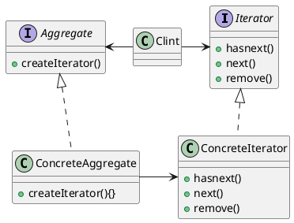

# 迭代器模式
* 将集合抽象出一个迭代器，迭代器只实现最基础的遍历集合的功能。
* 集合共同抽象，无论是什么集合都可以进行遍历，将遍历的方法进行统一，并且抽象出来。
[toc]

## 迭代器的定义
* 提供一种方法顺序访问一个聚合对象中的各个元素，而又不暴露其内部的表示。

## 迭代器模式的类图

## 单一责任
* 一个类应该只有一个引起变化的原因

# 组合模式
* 迭代器模式的复用，可以理解为迭代器的互相嵌套，递归。

## 组合模式的定义
* 允许你将对象组合成树形结构来表现"整体/部分"层次结构。组合能让客户以一致的方式处理个别对象以及对象组合。

