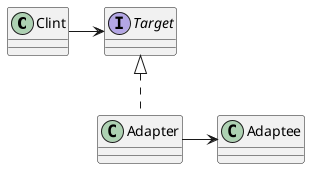

# 适配器
* 相当于就是转插头，将原本不适合的一头通过一个中间对象使得相通。
[toc]

## 何为适配器
* 转插头，转接头，都是很好的例子。
1. 请求方通过目标接口调用适配器的方法对适配器发出请求。
2. 适配器使用被是陪着接口把请求转换成被适配者的一个或多个调用接口。
3. 客户接收到调用的结果，但并未察觉这一切是适配器在起转换作用。

## 适配器的定义
* 将一个类的接口，转换成客户期望的另一个接口。适配器让原本接口不兼容的类可以无间合作。

## 对象类的适配器
* 通过多重继承从而继承两方的方法进行适配。不适用于JAVA，JAVA无法多重继承。

# 外观模式
模式|意图
:-:|:-:
装饰者|不改变接口，但加入责任
适配器|将一个接口转换成另一个接口
外观|让接口更简单

* 提供了一个统一的接口，用来访问子系统中的一群接口。外观定义了一个高层接口，让子系统更容易使用。
* 通俗一点来将就是每一个接口相当于一个命令，一个子系统封装了多个命令，最后创建一个统一的接口，整合这些子系统。

## 最少知识原则
* 只和你的密友交谈
* 无论什么接口只依赖最少的对象。
