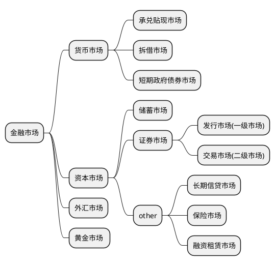

# 证券市场导论
> 一些投资证券市场的基础知识、以及专业术语

## 概述
### 金融市场
* 指的是经营货币资金借款、外汇买卖、有价证券交易(securities transaction)、债券和股票的发行、黄金等贵金属买卖场所的总称. 也可以是货币资金融通和金融资产交易场所和行为总和的简称.

### 资金融通(融资)
* 简称融资、是指货币流通及其相关的信用活动. 资金融通包括货币流通、存款的吸收与提取、货款的发放与收回、资金的相互拆借, 金银、外汇和有价证券的买卖, 保险、信托、国内外汇兑的往来, 等等. 资金融通按其有无媒介可分为直接融资和间接融资.
    * 直接融资: 指资金供求双方直接进行资金融通的活动,是资金需求者直接通过金融市场向社会上有资金盈余的机构和个人进行筹资.
    * 间接融资: 指通过银行进行的融资活动, 是资金需求者采取向银行等金融中介机构申请贷款的方式进行筹资.

### 证券市场
* 证券市场是有价证券发行和流通及与此相适应的组织与管理方式的总称. 广义的证券市场是指所有证券发行和交易的场所; 狭义的证券市场是指资本证券市场、货币证券市场和商品证券市场, 是股票、债券、商品期货、期权、利率期货等证券产品发行和交易的场所
    * 证券: 是各类财产所有权或债券凭证的通称, 是用来证明证券持有人有权取得相应权益的凭证. 股票、公债券、基金证券、票据、保险单、存款单等都是证券.

#### 证券市场历史
* 资本主义发展初期的原始积累阶段, 16世纪的西欧就已经出现了证券交易, 当时的 **里昂、安特卫普** 已成立证券交易所,最早在证券交易所进行交易的是国家证券.
* 1602年, 世界上第一个股票交易所在荷兰的阿姆斯特丹成立. 英国的第一家证券交易所最初主要交易政府债券.

## 机构体系
1. 按照证券性质的不同, 证券市场可分为股票市场、债券市场、基金市场.
2. 按组织形式的不同, 证券市场可分为: 
    ① 场内市场: 如上海、深圳、纽约(New York Stock Exchangr, NYSE)、美国证券交易所(American Stock Exchangr, AMEX)
    ② 场外市场: 是非交易所上市的股票和许多种不同债券的交易场所. 美国全国证券交易商协会自动报价(National Association of Securities Dealers Automated, NASDAQ) 系统旨在为场外交易市场中的交易商提供提供股票的价格信息, 以便交易商进行股票交易. 
    ③ 第三市场: 是交易所上市股票的场外交易市场
    ④ 第四市场: 是由买卖双方直接交易的股票市场
3. 按交易时间不同, 证券市场可分为: 
    ① 证券发行市场, 也称为初级市场或者一级市场
    ② 证券交易市场: 也称为次级市场或二级市场

### 金融市场体系构成

## 证券市场特征
1. 证券市场是价值直接交换的场所. 有价证券是价值的直接代表, 其本质是价值的一种直接表现形式, 因此证券市场本质上是价值的直接交换场所.
2. 证券市场是财产权利直接交换的场所. 证券市场伤的交易对象是作为经济权益凭证的股票、债券、投资基金券等有价证券, 它们本身近视一定量财产权利的代表, 因此其代表对一定数额财产的所有权或债权及相关的收益权. 
3. 证券市场是风险直接交换的场所. 有价证券既是一定收益权的代表, 也是一定风险的代表. 有价证券的交换在转让一定收益权的同时, 也把该有价证券所持有的风险转让.

## 证券市场的功能
### 融通资金
* 融通资金是证券市场的首要功能, 这一功能的另一作用是为资金供给者提供投资对象. 证券市场的融资功能是指证券市场为资金需求者筹集资金的功能.
> 根据金融学企业现金流的概念, 通过融资解决企业现金流的紧张. 
企业融资两种渠道, 间接融资: 即通过银行贷款获得资金. 直接融资: 即发行各种有价证券使社会闲散资金汇集称为长期资本. 前者提供的短期贷款期限较短, 适合解决企业流动资金不足的问题. 但长期贷款数量有限, 条件苛刻. 后者弥补了前者的不足, 使社会化大生产和企业大规模经营称为可能. 因为有长期稳定的现金流.

### 资本定价
* 证券市场的第二个基本功能就是为资本决定价格. 证券是资本的存在形式, 证券的价格实际上是证券代表的资本价格.
> 证券的价格是证券市场上证券供求双方共同作用的结果. 证券市场的运行形成了证券需求者竞争和证券供给者竞争的关系, 这种竞争的结果导致: 能产生高投资回报的资本, 市场的需求就大, 其相应的证券价格就高, 反之, 证券价格就低.

### 资本配置
* 证券市场的资本配置, 通过证券价格引导资本的流动, 从而实现资本合理配置的功能.
> 证券投资者对证券的收益十分敏感, 而证券收益率在很大程度上决定于企业的经济效益. 从长期来看, 经济效益好的企业拥有较多的投资者, 这种证券在市场上买卖也很活跃. 相反, 经济效益差的企业证券投资者越来越少, 市场伤的交易也不旺盛. 因此社会上部分资金会自动地流向经济效益好的企业, 远离经济效益差的企业.
这样, 证券市场就引导资本流向能产生高报酬的企业或行业, 从而使资本产生尽可能高的效率, 进而实现资源的合理配置.

## 中国证券市场发展特点
* 1984年11余额, 上海飞乐音响公司改制为股份有限公司(stock corporation) 成为中国第一家向公众公开发行股票的股份制有限公司.
* 1990年12月19日, 上海证券交易所正式开业; 1991年7月3日, 深圳证券交易所成立. 这两个证券交易所的成立标志着中国股票市场开始形成.

## 国际证券市场发展趋势
1. 证券市场网络化和一体化. 20世纪90年代以来, 随着计算机技术的飞速发展, 国际资本流动频繁切影响深远, 并最终导致全球证券市场的相互联系日趋紧密, 证券市场走向一体化
2. 金融机构混业化. 1999年11月4日, 美国国会通过了《金融服务现代化法案》, 废除了1933年经济危机时期制定的《格拉斯-斯蒂格尔法案》, 取消了银行、证券保险公司相互渗透的业务障碍, 标志着金融业分业制度的终结.
3. 金融风险复杂化. 随着金融货币政策专向, 全球贸易冲突不断升级, 国际贸易保护主义死灰复燃, 国际证券市场金融风险日趋复杂化.

# 证券投资的基本概念
* 证券投资者应有清醒的目标, 应了解投资的三要素、证券投资和证券市场主体.

## 投资三要素
* 投资是指经济主题购买金融资产或实物资产, 以便在未来某个时期获得与承担的风险成比例的收益经济行为.
### 收益
* 投资是为了获得未来报酬而采取的一种经济行为, 收益即投资所取得的报酬.
### 时间
* 投资是一个行为过程, 从投入到可能的未来报酬的获得, 要经过一定时间的间隔
### 风险
* 获取的报酬是不确定的, 是以风险为代价的. 时间间隔越长, 不可测因素越多, 不确定性就越大, 即风险越大

## 证券投资
1. 证券投资: 证券投资是指投资者(法人或自然人)买卖股票、债券、基金券等有价证券及其衍生品,以获取差价、利息及资本利得的投资行为和投资过程, 是间接投资的主要形式.
2. 证券投资的构成要素: 投资主体、投资客体、投资目的、投资方式、证券投资风险等.
3. 证券投资的基本特征:
     ① 证券投资具有高度的“市场力”
     ② 证券投资是对预期会带来收益的有价证券的风险投资
     ③ 投资和投机是证券投资活动中不可缺少的两种行为
     ④ 二级市场的证券投资不会增加社会资本总量, 而是在持有人之间进行再分配
     ⑤ 证券投资具有风险性
     ⑥ 证券投资具有收益性
4. 证券投资的原则包括:
     ① 效益与风险最佳组合原则. 效益与风险最佳组合是指在一定风险下, 尽可能使收益最大化; 或在一定收益的前提下, 尽可能使风险最小化
     ② 分散投资原则: 证券多样化, 建立科学的有效证券组合
     ③ 理智投资原则: 在分析、比较后审慎地投资
     ④ 投资程序: 确定投资方案、选择证券经纪商、办理证券交割和过户
5. 证券投资运行过程包括:
     ① 筹措投资资金
     ② 明确自己对收益和风险的态度
     ③ 全面掌握投资信息
     ④ 选择投资对象和入市时机
     ⑤ 进行投资决策和管理

## 证券市场主体
* 证券市场主体是指包括证券发行人和证券投资者在内的证券市场参与者
### 证券发行人
* 证券发行人是指为筹集资金而发行债券、股票等证券的政府及其机构、金融机构、公司或企业.
> 例如: 中央政府债券又称为国债, 发行人是财政部, 其发行是以国家信用做保证的, 具有很高的安全性, 可以认为其不存在信用风险

## 证券投资者
* 证券投资者是指通过证券进行投资的各类机构法人和自然人, 它们是证券市场的资金供给者. 证券投资者包括机构投资者和广大散户

## 证券工具
1. 债券: 债券是政府、金融机构、工商企业等机构直接向社会借债筹措资金时, 向投资者发行的, 并且承诺按约定条件偿还本金的债权、债务凭证
2. 股票: 股票是股份公司发给股东证明其所持有股份的一种有价证券, 它可以作为买卖对象和抵押品, 是证券市场上主要的长期信用工具之一. 股票是一种永不偿还的有价证券, 股份公司不会对股票持有人偿还本金
3. 证券投资基金: 证券投资基金是一种利益共享、风险共担的集合投资方式, 即通过发行基金单位集中投资者的基金, 由基金托管人托管、基金管理人管理和运用资金, 从事股票、债券、外汇、货币等金融工具投资, 以获得投资收益和资本增值
    * 其中根据基金单位是否可增加或赎回, 投资基金可分为开放式基金(opened-end fund)和封闭式基金(closed-end fund)
    投资基金即使投资主体--参与证券投资, 将集中的资金投资与各种有价证券, 又提供投资客体--发行供投资者选择的股票或收益凭证, 更是投资的专业中介机构--连接社会公众投资者与筹资者的桥梁

## 证券中介机构
* 证券中介机构是为证券的发行与交易提供服务的各类机构, 主要有证券经营机构和证券服务机构, 通常把两者合称为证券中介机构
    1. 证券经营机构: 根据开展业务的状况, 可以分为证券承销商、证券经纪商和证券自营商
    2. 证券服务机构: 证券服务机构可以分为证券登记机构和结算机构、证券投资咨询机构、会计事务所、律师事务所、资产评估机构、证券信用评级机构

## 证券自律组织与证券监管机构
1. 证券自律组织: 证券自律组织包括证券交易所和证券业协会. 证券交易所是提供证券集中竞价交易的、不以盈利为目的的事业法人
2. 证券监管机构: 在我国, 中国证券监督管理委员会为证券市场的最高监管机构
